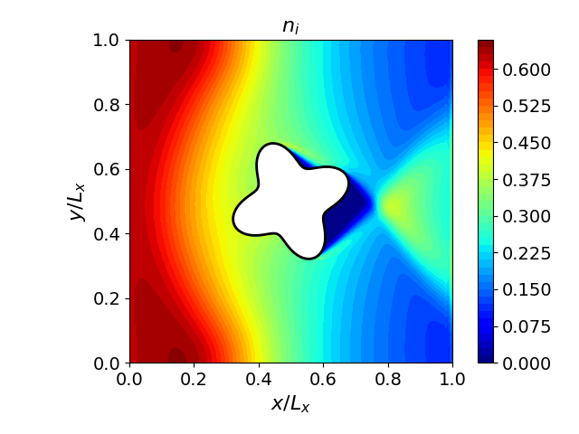
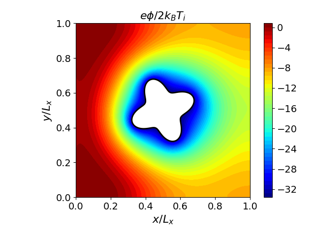

# Plasma Flow Past a Star-Shaped Dielectric Obstacle

A Vlasov-Poisson simulation of a plasma flowing past a 4-pointed star-shaped dielectric obstacle, using the reduced model (single ion species with Boltzmann electrons).

## Physics

- **Domain**: $[0, 1] \times [0, 1]$
- **Obstacle**: Star shape centered at $(0.5, 0.5)$
- **Interior permittivity**: 1000 (dielectric star), exterior: 1 (plasma)
- **Star potential**: fixed Dirichlet
- **Boundary conditions**: Ions injected from the left, reflective top/bottom, zero-inflow at right
- **Grid**: $128 \times 128$ spatial, $100 \times 50$ velocity

Parameters are configured in `input.ini`. Post-processing scripts are included in this folder.

## Results

A wake forms behind the star, visible in the number density depletion downstream. The electric field is strongest at the star tips where curvature is highest.
